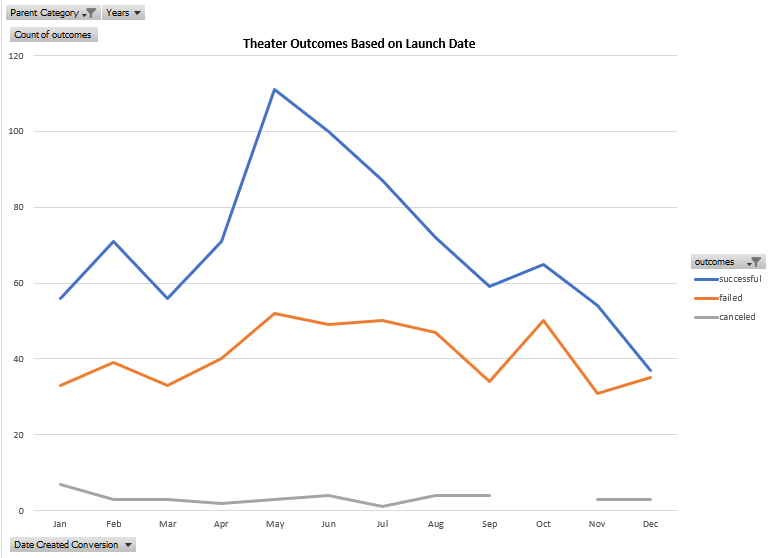

# An Analysis of Kickstarter Campaigns
Performing analysis on Kickstarter data to uncover 
trends.  

# Kickstarting with Excel
Microsoft Excel was the tool utilized to analyze and filter the appropriate information for Louise to realize trends and to make a data-based decision on the results of her fundraising goals.

## Overview of Project
By utilizing different charts and graphs to depict this data, further analysis determines how different campaigns fared in different parts of the globe, within certain catagories/subcategories and even the amounts of money raised per donor.  With this data Louise is able to make cognitive decisions on how to change her market strategy, for example, with outcomes based on launch dates or funding goals.

### Purpose
The purpose of this project was to encapsulate and analyze a dataset of possible theatrical productions spanning across 2009-2017, within multiple countries, with different funding initiatives.  This data will prove to be evidence on the success level of each of these different campaigns and a roadmap on how to maximize funding targets for future similar campaigns.

## Analysis and Challenges
Futher probing lead to two succint charts that require more technical analysis.  This was done by creating pivot tables within the Excel program, charting certain criteria to pinpoint and get clarity on possible trends.  Taking a further look into the technical analysis allows one to make informed decisions upon the findings displayed in the two charts depicted below:
* Outcomes based on Launch Date
* Outcomes based on goals

The Outcomes Based on Lauch Date chart depict successful, failed and canceled theatrical outcomes during certain months of the year.

### Analysis of Outcomes Based on Launch Date

The chart that shows the Outcomes Based on Goals is stating the percentage of the successful, failed, canceled theatrical productions in terms of pledge goals.

### Analysis of Outcomes Based on Goals

### Challenges and Difficulties Encountered
Initially, the challenge wasn't difficult to comprehend.  There were quite a few step-by-step instructions on how to chart and graph the necessary data.  The difficulty for me is to really understand what data to chart, how this is of value and am I really answering the question that was posed in the beginning of this challenge?  If the instructions weren't already provided for me on 'what' to put into the chart, how would I know what to do?  I would expect that practice on data analysis will help mature my knowledge of how, what and why.  It's been a good challenge though, as I've been exposed to Github/Gitlab/VB.  I've already learned quite a bit in this first week and excited to learn much more with additional challenges in the weeks ahead.

## Results

- What are two conclusions you can draw about the Outcomes based on Launch Date?
1. The trending signifies that the months of May/June are the best times during the year to obtain pledges for successful kickstarters.
2. There typically aren't any canceled projects between the months of September and November.

- What can you conclude about the Outcomes based on Goals?
This chart represents the realtionship between the successful, failed and canceled initiatives and how they relate to the funding goals during certain times of the year.

- What are some limitations of this dataset?
To further analyze the data depicted here, I would like to go deeper to get a feel of the types of backers (professionals vs non-professionals) or how the pledges are taken (electronically vs cash).  That may hone in on further identifying ways of obtaining more pledges or funding for these theatrical productions.

- What are some other possible tables and/or graphs that we could create?
Dependent upon the type of information Louise would like to obtain, for a certain region of the world for example, funding just for Europe or for other specific countries.  She could obtain other charts/graphs as well to see if she could target a certain pledge goal for a certain category of production during a few months of the year, maybe what that would look like and how to improve on targets during that time of the year.  I believe the important part is really trying to make sense of the dataset in a way that comprehensively provides value for the person that is requesting the analysis.